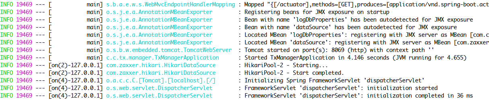

# 初始化准备

## 一、导入数据 Mariadb (MySQL) 数据库

demo示例依赖txlcn-demo数据库建表语句如下:      
```$xslt
DROP TABLE IF EXISTS `t_demo`;
CREATE TABLE `t_demo`  (
  `id` bigint(20) NOT NULL AUTO_INCREMENT,
  `demo_field` varchar(255) CHARACTER SET utf8 COLLATE utf8_general_ci NULL DEFAULT NULL,
  `group_id` varchar(32) CHARACTER SET utf8 COLLATE utf8_general_ci NULL DEFAULT NULL,
  `unit_id` varchar(32) CHARACTER SET utf8 COLLATE utf8_general_ci NULL DEFAULT NULL,
  `app_name` varchar(32) CHARACTER SET utf8 COLLATE utf8_general_ci NULL DEFAULT NULL,
  `create_time` datetime(0) NULL DEFAULT NULL,
  PRIMARY KEY (`id`) USING BTREE
) ENGINE = InnoDB AUTO_INCREMENT = 26 CHARACTER SET = utf8 COLLATE = utf8_general_ci ROW_FORMAT = Dynamic;

```

TxManager依赖tx-manager数据库建表语句如下:      
```$xslt
DROP TABLE IF EXISTS `t_tx_exception`;
CREATE TABLE `t_tx_exception`  (
  `id` bigint(20) NOT NULL AUTO_INCREMENT,
  `group_id` varchar(32) CHARACTER SET utf8mb4 COLLATE utf8mb4_general_ci NULL DEFAULT NULL,
  `unit_id` varchar(32) CHARACTER SET utf8mb4 COLLATE utf8mb4_general_ci NULL DEFAULT NULL,
  `mod_id` varchar(32) CHARACTER SET utf8mb4 COLLATE utf8mb4_general_ci NULL DEFAULT NULL,
  `transaction_state` tinyint(4) NULL DEFAULT NULL,
  `registrar` tinyint(4) NULL DEFAULT NULL COMMENT '-1 未知 0 Manager 通知事务失败， 1 client询问事务状态失败2 事务发起方关闭事务组失败',
  `ex_state` tinyint(4) NULL DEFAULT NULL COMMENT '0 待处理 1已处理',
  `create_time` datetime(0) NULL DEFAULT NULL,
  PRIMARY KEY (`id`) USING BTREE
) ENGINE = InnoDB AUTO_INCREMENT = 967 CHARACTER SET = utf8mb4 COLLATE = utf8mb4_general_ci ROW_FORMAT = Dynamic;

```

## 二、启动TxManager

TxManager主要配置如下:   
参数配置说明见 [TxManager配置](setting/manager.html)
```properties
spring.application.name=tx-manager
server.port=8069

spring.datasource.driver-class-name=com.mysql.jdbc.Driver
spring.datasource.url=jdbc:mysql://ip:port/tx-manager?characterEncoding=UTF-8
spring.datasource.username=user
spring.datasource.password=passwd

mybatis.configuration.map-underscore-to-camel-case=true
mybatis.configuration.use-generated-keys=true

```

启动TxManager



## 三、准备注册中心

* 启动ZooKeeper (Dubbo)
* 启动Consul (SpringCloud)

## 四、微服务模块代码（TxClient）
[Dubbo-Demo](dubbo.html)

[SpringCloud-Demo](springcloud.html)

## 五、检验微服务间的分布式事务
（1）正常提交事务

访问 发起方提供的Rest接口 `/txlcn?value=the-value`。发现事务全部提交  


（2）回滚事务

修改微服务 发起方Client 业务，在返回结果前抛出异常，再请求Rest接口。发现发起方由于本地事务回滚，而参与方D、E，由于TX-LCN的协调，数据也回滚了。  

