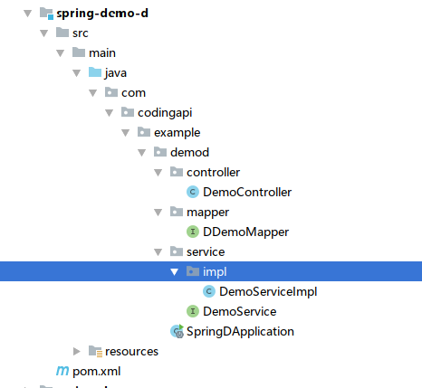
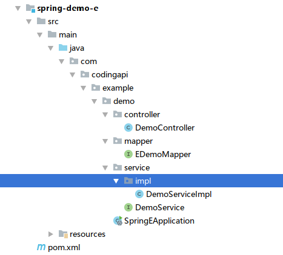
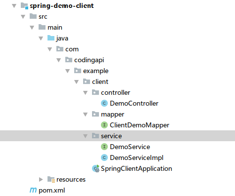

# SpringCloud示例

## 一、事务参与方D
（1）新建Maven 工程  
  
（2）项目配置文件 application.properties  
```properties
spring.application.name=spring-demo-d
server.port=12002

spring.datasource.driver-class-name=com.mysql.jdbc.Driver
spring.datasource.url=jdbc:mysql://ip:port/txlcn-demo?characterEncoding=UTF-8
spring.datasource.username=root
spring.datasource.password=123456
spring.datasource.hikari.maximum-pool-size=20

mybatis.configuration.map-underscore-to-camel-case=true
mybatis.configuration.use-generated-keys=true

```
src:[https://github.com/codingapi/tx-lcn/tree/5.0.0.beta/example/spring-demo-d](https://github.com/codingapi/tx-lcn/tree/5.0.0.beta/example/spring-demo-d)  

## 二、事务参与方E
（1）新建Maven 工程  
  
（2）项目配置文件 application.properties  
```properties
spring.application.name=spring-demo-e
server.port=12003

spring.datasource.driver-class-name=com.mysql.jdbc.Driver
spring.datasource.url=jdbc:mysql://ip:port/txlcn-demo?characterEncoding=UTF-8
spring.datasource.username=root
spring.datasource.password=123456
spring.datasource.hikari.maximum-pool-size=20

mybatis.configuration.map-underscore-to-camel-case=true
mybatis.configuration.use-generated-keys=true

```
src:[https://github.com/codingapi/tx-lcn/tree/5.0.0.beta/example/spring-demo-e](https://github.com/codingapi/tx-lcn/tree/5.0.0.beta/example/spring-demo-e)  

## 三、事务发起方Client
（1）新建Maven 工程  
  
（2）项目配置文件 application.properties  
```properties
spring.application.name=spring-demo-client
server.port=12001


spring.datasource.driver-class-name=com.mysql.jdbc.Driver
spring.datasource.url=jdbc:mysql://ip:port/txlcn-demo?characterEncoding=UTF-8
spring.datasource.username=root
spring.datasource.password=123456
spring.datasource.hikari.maximum-pool-size=20

mybatis.configuration.map-underscore-to-camel-case=true
mybatis.configuration.use-generated-keys=true


# 关闭Ribbon的重试机制
ribbon.MaxAutoRetriesNextServer=0

```
src:[https://github.com/codingapi/tx-lcn/tree/5.0.0.beta/example/spring-demo-client](https://github.com/codingapi/tx-lcn/tree/5.0.0.beta/example/spring-demo-client)  

## 四、启动SpringCloud微服务
（1） 事务参与方 D  

（2） 事务参与方 E  

（3） 事务发起方 Client  

