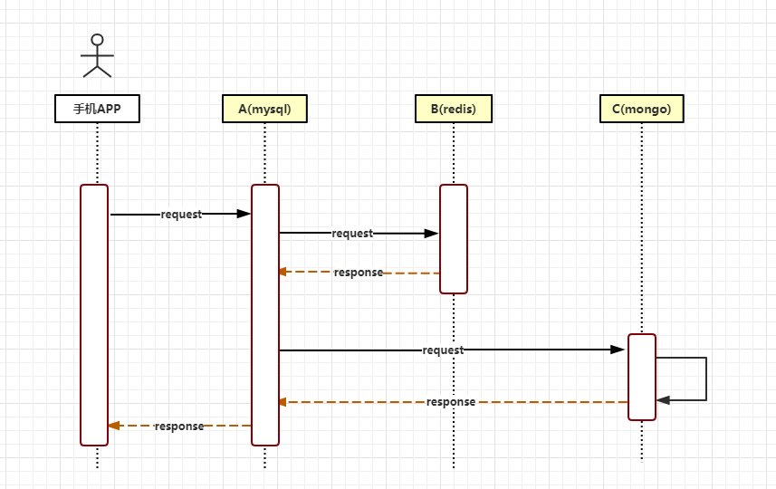

# 背景

&nbsp;&nbsp;&nbsp;&nbsp;LCN框架在2017年6月份发布第一个版本，从开始的1.0，已经发展到了5.0版本。     
LCN名称是由早期版本的LCN框架命名，在设计框架之初的1.0 ~ 2.0的版本时框架设计的步骤是如下,各取其首字母得来的LCN命名。
       
锁定事务单元（lock）  
确认事务模块状态(confirm)    
通知事务(notify)       

&nbsp;&nbsp;&nbsp;&nbsp;5.0以后由于框架兼容了LCN、TCC、TXC三种事务模式，为了避免区分LCN模式，特此将LCN分布式事务改名为TX-LCN分布式事务框架。

## 框架定位

> LCN并不生产事务，LCN只是本地事务的协调工

TX-LCN定位于一款事务协调性框架，框架其本身并不操作事务，而是基于对事务的协调从而达到事务一致性的效果。

## 解决方案
&nbsp;&nbsp;&nbsp;&nbsp;在一个分布式系统下存在多个模块协调来完成一次业务。那么就存在一次业务事务下可能横跨多种数据源节点的可能。TX-LCN将可以解决这样的问题。

&nbsp;&nbsp;&nbsp;&nbsp;例如存在服务模块A 、B、 C。A模块是mysql作为数据源的服务，B模块是基于redis作为数据源的服务，C模块是基于mongo作为数据源的服务。若需要解决他们的事务一致性就需要针对不同的节点采用不同的方案，并且统一协调完成分布式事务的处理。

方案：    

&nbsp;&nbsp;&nbsp;&nbsp;若采用TX-LCN分布式事务框架，则可以将A模块采用LCN模式、B/C采用TCC模式就能完美解决。