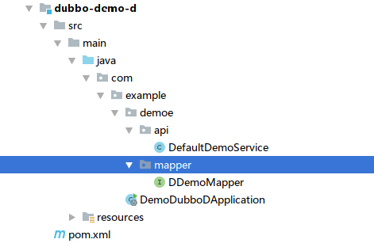
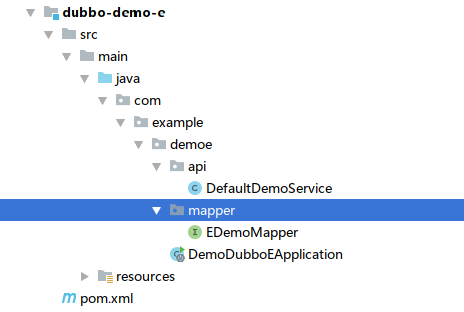
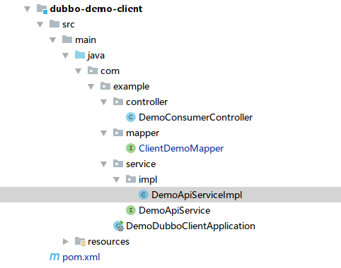
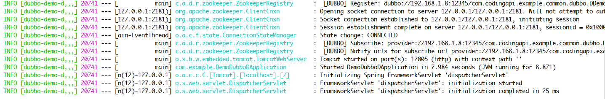
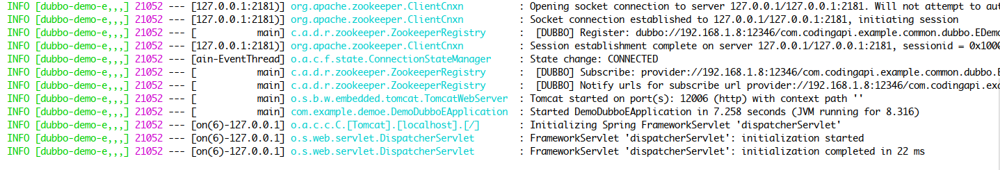

# Dubbo示例

## 一、事务参与方 D
（1）新建Maven 工程  

（2）项目配置文件 application.properties
```properties
# Spring boot application
spring.application.name=dubbo-demo-d
server.port=12005
management.port=12008

# Service version
demo.service.version=1.0.0

# Base packages to scan Dubbo Components (e.g @Service , @Reference)
dubbo.scan.basePackages=com.example

# Dubbo Config properties
## ApplicationConfig Bean
dubbo.application.id=dubbo-demo-d
dubbo.application.name=dubbo-demo-d

## ProtocolConfig Bean
dubbo.protocol.id=dubbo
dubbo.protocol.name=dubbo
dubbo.protocol.port=12345

## RegistryConfig Bean
dubbo.registry.id=my-registry
dubbo.registry.address=127.0.0.1:2181
dubbo.registry.protocol=zookeeper
dubbo.application.qos.enable=false

## DB
spring.datasource.driver-class-name=com.mysql.jdbc.Driver
spring.datasource.url=jdbc:mysql://127.0.0.1:3306/txlcn-demo\
  ?characterEncoding=UTF-8&serverTimezone=UTC
spring.datasource.username=root
spring.datasource.password=123456
spring.datasource.hikari.maximum-pool-size=20
mybatis.configuration.map-underscore-to-camel-case=true
mybatis.configuration.use-generated-keys=true
```
src: [https://github.com/codingapi/txlcn-demo/dubbo-demo-d](https://github.com/codingapi/txlcn-demo/tree/master/dubbo-demo-d)

## 二、事务参与方 E
（1）新建Maven 工程  

（2）项目配置文件 application.properties
```properties
# Spring boot application
spring.application.name=dubbo-demo-e
server.port=12006
management.port=12009

# Service version
demo.service.version=1.0.0

# Base packages to scan Dubbo Components (e.g @Service , @Reference)
dubbo.scan.basePackages=com.example

# Dubbo Config properties
## ApplicationConfig Bean
dubbo.application.id=dubbo-demo-e
dubbo.application.name=dubbo-demo-e

## ProtocolConfig Bean
dubbo.protocol.id=dubbo
dubbo.protocol.name=dubbo
dubbo.protocol.port=12346

## RegistryConfig Bean
dubbo.registry.id=my-registry
dubbo.registry.address=127.0.0.1:2181
dubbo.registry.protocol=zookeeper

dubbo.application.qos.enable=false

#db
spring.datasource.driver-class-name=com.mysql.jdbc.Driver
spring.datasource.url=jdbc:mysql://127.0.0.1:3306/txlcn-demo\
  ?characterEncoding=UTF-8&serverTimezone=UTC
spring.datasource.username=root
spring.datasource.password=123456
spring.datasource.hikari.maximum-pool-size=20

mybatis.configuration.map-underscore-to-camel-case=true
mybatis.configuration.use-generated-keys=true

```
src:[https://github.com/codingapi/txlcn-demo/dubbo-demo-e](https://github.com/codingapi/txlcn-demo/tree/master/dubbo-demo-e)

## 三、事务发起方 Client
（1）新建Maven 工程  

（2）项目配置文件 application.properties
```properties
# Spring boot application
spring.application.name=dubbo-demo-client
server.port=12004
management.port=12007

# Service Version
demo.service.version=1.0.0

# Dubbo Config properties
## ApplicationConfig Bean
dubbo.application.id=dubbo-demo-client
dubbo.application.name=dubbo-demo-client
dubbo.application.d=dubbo-demo-d
dubbo.application.e=dubbo-demo-e

## ProtocolConfig Bean
dubbo.protocol.id=dubbo
dubbo.protocol.name=dubbo
dubbo.protocol.port=12345
dubbo.registry.protocol=zookeeper
dubbo.registry.address=127.0.0.1:2181

## db
spring.datasource.driver-class-name=com.mysql.jdbc.Driver
spring.datasource.url=jdbc:mysql://127.0.0.1:3306/txlcn-demo\
  ?characterEncoding=UTF-8&serverTimezone=UTC
spring.datasource.username=root
spring.datasource.password=123456
spring.datasource.hikari.maximum-pool-size=20

mybatis.configuration.map-underscore-to-camel-case=true
mybatis.configuration.use-generated-keys=true
```
src:[https://github.com/codingapi/txlcn-demo/dubbo-demo-client](https://github.com/codingapi/txlcn-demo/tree/master/dubbo-demo-client)

## 四、启动Dubbo微服务
（1） 事务参与方 D  

（2） 事务参与方 E  

（3） 事务发起方 Client  

