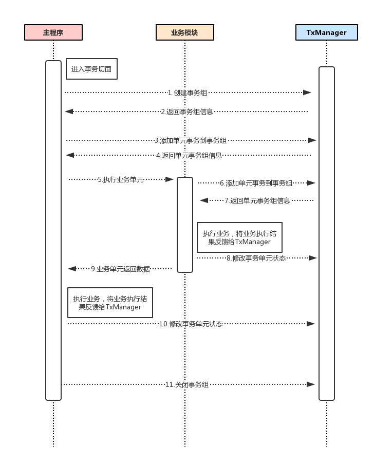

# LCN分布式事务框架的设计原理 （V2.0.0）

框架基于spring事务框架的基础之上做的再次封装，通过控制协调本地事务与全局事务的一致性从而达到分布式事务的效果。

特别说明：LCN框架 非TCC机制，非2PC机制 非3PC机制，原理详细说明请继续阅读。

## 事务操作步骤

1. 锁定事务单元（lock）
2. 确认事务模块状态(confirm)
3. 通知事务(notify)

## 锁定事务单元

我们假设方法A是分布式事务发起方法，A调用了B和C，B有调用了B1 B1有调用了B11和B12。如下图：

那么他们的流程为  
. 当执行A方法时，会先创建事务组。然后A将自己的事务单元添加到TxManager。此时A的业务方法会被调用。  
. B被执行，B也会将自己的事务单元添加到TxManager，然后执行B的业务单元。   
. B1被执行，B1也会将自己的事务单元添加到TxManager，然后执行B1的业务单元。  
. B11被执行，B11也会将自己的事务单元添加到TxManager，然后执行B11的业务单元，B11的业务执行完以后返回数据并通知TxManager事务单元状态，然后进入等待通知状态。  
. B12被执行，B12也会将自己的事务单元添加到TxManager，然后执行B12的业务单元，B12的业务执行完以后返回数据并通知TxManager事务单元状态，然后进入等待通知状态。  
. B1事务执行次完毕，通知TxManager事务单元状态，然后进入等待通知状态。  
. B事务执行次完毕，通知TxManager事务单元状态，然后进入等待通知状态。  
. C被执行，C也会将自己的事务单元添加到TxManager，然后执行C的业务单元，C的业务执行完以后返回数据并通知TxManager事务单元状态，然后进入等待通知状态。  
. A事务执行次完毕，通知TxManager事务单元状态，然后进入等待通知状态。  
. A发起通知TxManager第一阶段已经执行完毕。  

备注：LCN在处理事务的时候都将开启子线程处理事务，主线程返回业务数据，从而避免主线程堵塞。

## 确认事务模块状态

当A通知TxManager第一阶段已经执行完毕后，TxManager会检查事务单元模块是否都有效，若有效则进入通知确认阶段，否则直接进入第三阶段回滚事务。

看似确认事务模块状态没有太大作用，其实主要用意是两点
1. 确认与事务模块是否正常通讯
2. 确认事务单元模块是否等待超时事务已经回滚。当事务单元接受到TxManager的事务单元模块确认通知以后，事务单元模块将不会自动回滚事务等待TxManager通知。
3. 查看各个业务模块是否自动回滚。

## 通知事务

回滚的情况：
1. 当事务模块存在异常，那么在第一阶段时就能得知整个事务状态，TxManager直接通知各个事务单元事务回滚。
2. 若事务单元迟迟没有接受到消息，事务也将会自动回滚，因为在第一阶段处理时，将每个业务模块都设置了自动回滚等待机制，最大等待时间见`transaction_wait_max_time`参数说明。
3. 若事务都正常但在确认事务模块状态时，发现事务无法访问，则TxManager会通知事务模块回滚。

提交的情况:

当各个事务状态均正常响应，网络状态也无异常，且长链接保持链接状态下，各个事务模块均未自动回滚时。TxManager将会通知各个事务全部提交事务。

