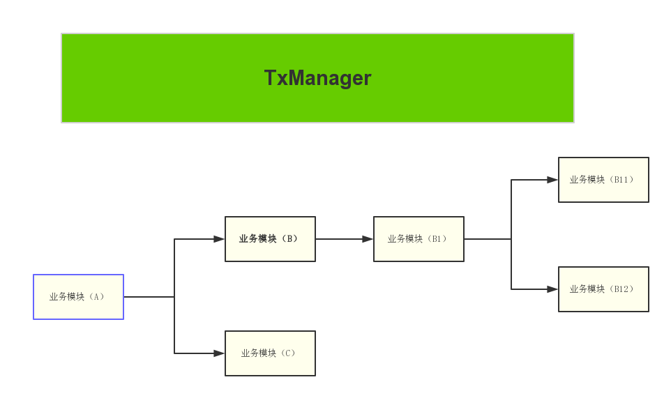

# LCN分布式事务框架的设计原理 （V2.3.0）

框架基于spring事务框架的基础之上做的再次封装，通过控制协调本地事务与全局事务的一致性从而达到分布式事务的效果。

特别说明：LCN框架 非TCC机制，非2PC机制 非3PC机制，原理详细说明请继续阅读。

## 事务操作步骤

1. 锁定事务单元
2. 通知事务
3. 自动回滚补偿
4. 挂机补偿

## 锁定事务单元

我们假设方法A是分布式事务发起方法，A调用了B和C，B有调用了B1 B1有调用了B11和B12。如下图：

那么他们的流程为  
. 当执行A方法时，会先创建事务组。然后执行A的业务方法。  
. B被执行，B也会先记录补偿日志信息，然后执行B的业务单元。
. B1被执行，B1也会先记录补偿日志信息，然后执行B1的业务单元。   
. B11被执行，B11也会先记录补偿日志，然后执行B11的业务单元，若异常直接抛出异常回滚，那么下面方法将不执行，直接到最后A的catch逻辑，若正常则添加事务组到TxManager，删除补偿日志然后返回数据进入等待通知状态。   
. B12被执行，解释说明同上。   
. B1事务执行次完毕，若B11 B12 存在异常则会继续抛出异常，然后删除补偿日志，若业务正常也会删除补偿日志，通知TxManager事务单元状态，然后进入等待通知状态。  
. B事务执行次完毕，解释说明同上。  
. C被执行，C也会先记录补偿日志，然后执行C的业务单元，若异常直接抛出异常回滚，那么下面方法将不执行，直接到最后A的catch逻辑，若正常则添加事务组到TxManager，删除补偿日志然后返回数据进入等待通知状态。  
. A事务执行次完毕，首先会执行状态通知到TxManager，若catch到异常，则直接回滚事务，若事务正常则直接提交。   

备注：LCN在处理事务的时候都将开启子线程处理事务，主线程返回业务数据，从而避免主线程堵塞。

## 通知事务

当A通知TxManager第一阶段已经执行完毕后，TxManager会检查事务单元模块是否都有效。若均正常TxManager将直接提交事务模块。

回滚的情况：
1. 当事务模块存在异常，TxManager直接通知各个事务单元事务回滚。
2. 若事务单元迟迟没有接受到消息，事务也将会触发自动回滚补偿机制，执行之前会先给TxManager确认事务的状态，若事务提交，则依旧提交，否则才回滚。

提交的情况:

1. 当各个事务状态均正常响应，网络状态无异常，长链接保持链接状态，事务模块未触发自动回滚机制；则TxManager将会通知各个事务全部提交事务。
2. 当事务模块没有收到提交的请求时，会触发自动回滚补偿机制，此时会与TxManager确认事务的状态，若事务提交，则依旧提交，否则才回滚。

## 自动回滚补偿

该步骤只有当未接受到TxManager的通知事务指令时才会被触发。

该环节主要是为了维护事务一致性设计的，避免事务管道端口或者通讯异常时接受不到TxManager指令，而设计的补偿性的操作。

1. 当事务模块没有收到提交或回滚的请求时，会被触发制自动回滚机制，此时会先与TxManager确认事务的状态，若事务提交，则依旧提交，否则才将回滚事务。

## 挂机补偿

该步骤只有当服务器出现故障或者挂机时在下次启动时才会激活。

事务在执行的过程中会记录操作的事务信息，当事务正常处理完以后LCN将立即清理这些记录。若事务模块挂机了当再次启动时，将会检索这些事务记录，然后在通过事务记录信息恢复事务的处理。

