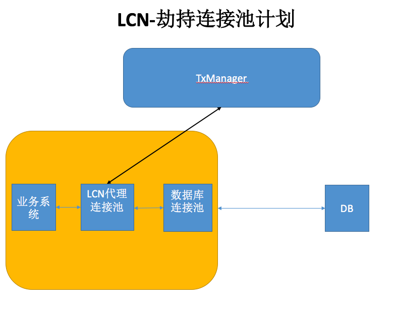

# LCN分布式事务框架的设计原理 （V3.0.0）

框架基于协调spring事务，通过控制协调本地事务与全局事务的一致性从而达到分布式事务的效果。

特别说明：LCN框架 非TCC机制，非2PC机制 非3PC机制，原理详细说明请继续阅读。

##  重新认识LCN  

   在2.3之前的版本上，协调事务操作都是在spring事务单元的切面里完成的。由于需要处理事务同时还需要返回数据,因此我们在事务单元上开启线程处理分布式事务逻辑。这样做存在一定的局限性，首先影响业务执行的效率，再有就是在一些场景下很难区分开本地事务与分布式事务的切面范围。因此我们在3.0上提出了劫持连接池计划。我们将事务的分布式事务逻辑控制从spring事务切面转移到了连接池上，这样做释放了spring事务模块的性能，lcn将不在做事务控制，事务控制权完全移交给本地事务控制，同时也让lcn事务模块更加清晰合理。

## 关于劫持连接池计划

 

说明：

 我们封装了一个代理连接池，有代理连接池代理本地连接池然后再提供给业务系统使用。
 
 连接池操作步骤：
  1. 业务系统通过切面参数传递给事务控制对象.
  2. 事务控制对象在获取jdbc连接.
    此时代理连接池通过这些信息来识别是否是分布式事务，若非分布式事务则直接返回一个有效的普通连接对象。若为分布式事务则返回LCNConnection对象
  3. 执行本地事务然后释放事务资源.
    LCNConnection配合本地事务完成jdbc操作以后，在释放连接的时候判断是否需要参与分布式事务。若需要参与分布式事务，则LCNConnection会执行"假关闭"，然后进入等待并于TxManager完成事务统一协调处理

其他业务原理依旧与2.3设计一致   

   [参考2.3设计](README2.3.md)
   
   
 