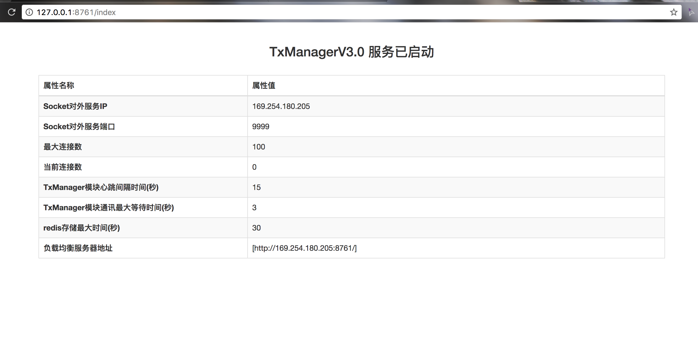
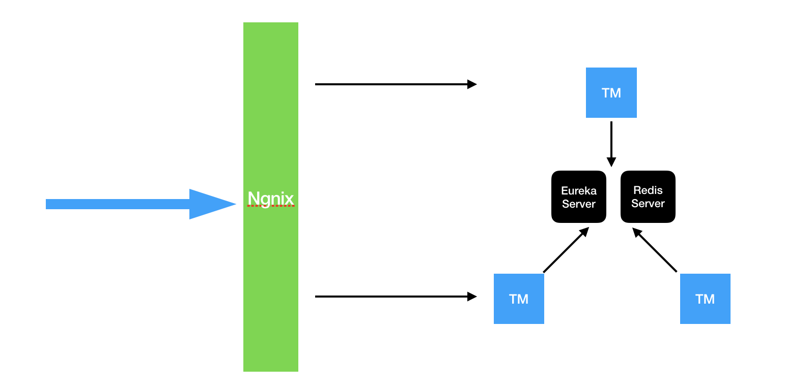

**TxManager是LCN分布式事务框架的事务协调器，框架基于Netty做消息通讯，事务控制数据存储在Redis中。**


## 使用教程
1. 启动redis服务


2. 配置application.properties/bootstrap.yml文件

```
#服务端口
server.port=8761
spring.application.name=tx-manager
spring.thymeleaf.prefix=classpath:/html/
spring.thymeleaf.suffix=.html


#redis
#redis主机地址
spring.redis.hostName=127.0.0.1
#redis主机端口
spring.redis.port=6379
#redis链接密码
spring.redis.password=
spring.redis.pool.maxActive=10
spring.redis.pool.maxWait=-1
spring.redis.pool.maxIdle=5
spring.redis.pool.minIdle=0
spring.redis.timeout=0


#业务模块与TxManager之间通讯的最大等待时间（单位：秒）
transaction_netty_delay_time = 3
#业务模块与TxManager之间通讯的心跳时间（单位：秒）
transaction_netty_heart_time = 15
#存储到redis下的数据最大保存时间（单位：秒）
redis_save_max_time=30
#socket server Socket对外服务端口
socket.port=9999
# 最大socket连接数
socket.max.connection=100


```


```
eureka:
  instance:
    hostname: ${hostname:localhost}
    preferIpAddress: true
  server:
    peerEurekaNodesUpdateIntervalMs: 60000
    enableSelfPreservation: false
  client:
    serviceUrl:
      defaultZone: http://localhost:8761/eureka/
    healthcheck:
      enabled: true
    eurekaServiceUrlPollIntervalSeconds: 60

endpoints:
  health:
    sensitive: false


```

注意：server.port要与defaultZone的端口一致


3. 运行TxManagerApplication，然后访问`http://127.0.0.1:8761/index` 正常如下：



备注：启动过程中可能会发现一些异常，是由于eureka的启动顺序导致的，可以忽略。只要确保redis配置正确，且可访问index界面即可。

## 高可用配置

原理图:



1. 配置Redis集群

2. 配置TM服务
部署多分tm，然后修改各个配置文件的eureka.client.serviceUrl.defaultZone，指向各服务的tm地址中间用"，"分割。

例如： http://192.168.1.101:8761/eureka/,http://192.168.1.102:8761/eureka/,http://192.168.1.103:8761/eureka/

3. 配置nginx负载均衡

负载均衡TM服务。

4. 修改各事务模块的tx.properties配置文件url地址参数为nginx负载均衡的地址。


